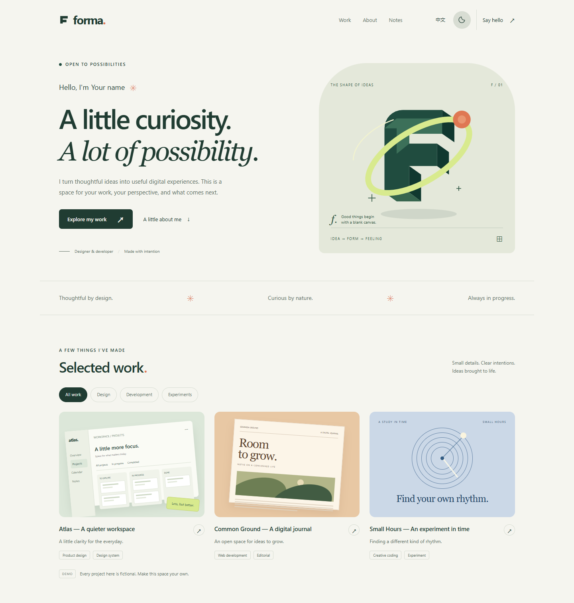
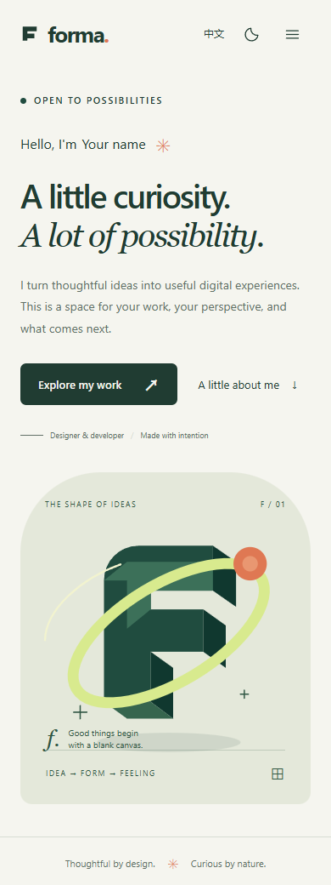
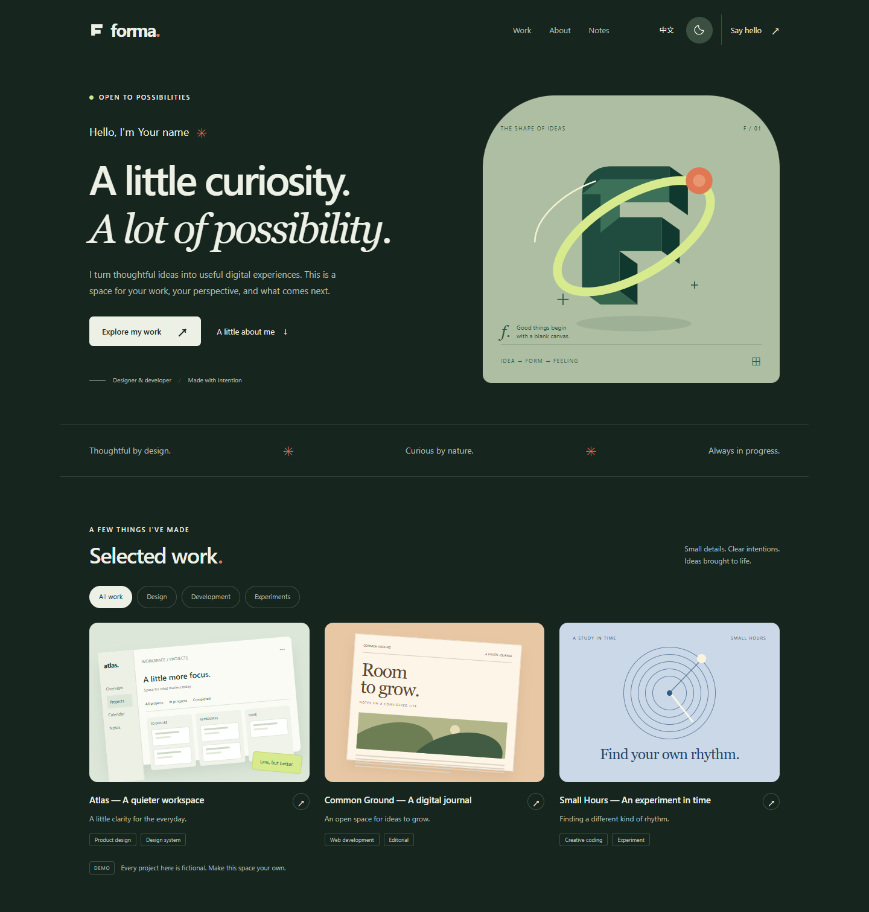

<div align="center">

# Forma

**A little curiosity. A lot of possibility.**

A considered portfolio template for designers, developers, and curious people.

Plain HTML · CSS · JavaScript · English / 中文 · MIT

[Quick start](#quick-start) · [Customization](#make-it-yours) · [Deploy](#deploy-to-github-pages) · [中文说明](#中文说明)

</div>



**Your work deserves a little room to breathe.** Forma pairs forest green, warm paper, editorial type, and locally drawn illustrations with a practical, easily editable portfolio. No framework setup. No package installation. No remote font requests.

## Why Forma?

- **One content file.** Change your name, story, projects, notes, and optional links in `assets/config.js`.
- **Two languages.** English and Chinese, with persisted language preferences and fallback translations.
- **Two themes.** Light and dark, with saved preferences and optional system theme matching.
- **A complete portfolio.** Intro, filterable work, project dialogs, skills, timeline, writing, and contact.
- **Thoughtful interactions.** Mobile menu, keyboard navigation, native modal dialogs, visible focus states, and reduced motion support.
- **Local assets only.** No analytics, trackers, embedded third-party services, or external fonts in the default page.
- **Made to fork.** Relative asset paths work on GitHub project Pages; a small workflow checks and publishes the site.

All identities, organizations, projects, dates, and articles in this repository are **placeholders or fictional examples**. No real contact address or social profile is configured. The demo contact button opens an explanation rather than sending a message.

<details>
<summary>Mobile and dark theme previews</summary>

| Mobile | Dark theme |
| --- | --- |
|  |  |

</details>

## Quick start

1. Click **Use this template → Create a new repository** on GitHub, or download the source ZIP.
2. Open `index.html` in a modern browser. That's the entire setup.
3. Edit `assets/config.js` and refresh.

For a local HTTP preview, with Python installed:

```sh
python -m http.server 8080
```

Open `http://localhost:8080`. Serving files locally is optional; no installation or server is required to use the template.

## Make it yours

Start with `assets/config.js`:

```js
// Text can be a plain string, or a bilingual object.
name: { en: 'Your name', zh: '你的名字' },
role: { en: 'Your role', zh: '你的角色' },

// Leave these empty until you want them to be public.
email: '',
resumeUrl: '',
socials: [],
```

| What to change | Where |
| --- | --- |
| Name, headline, bio, skills, optional contact links | `assets/config.js` → `profile` |
| Browser title and search description | `assets/config.js` → `siteTitle`, `siteDescription` |
| Project cards, categories, details, links | `assets/config.js` → `projects` |
| Experience entries | `assets/config.js` → `experience` |
| Articles and reading times | `assets/config.js` → `notes` |
| Initial language and theme | `defaultLanguage`, `defaultTheme` |
| Hide fictional-content hints after customization | `showTemplateHints: false` |
| Colors, typography, spacing, responsive layout | `assets/styles.css` |
| Interface translations | `assets/app.js` → `ui` |
| Structure, illustration, wordmark, favicon | `index.html`, `assets/favicon.svg` |

For projects, use `category: 'design'`, `'development'`, or `'experiment'`. Choose `art: 'atlas'`, `'ground'`, `'hours'`, or `'generic'` for the included illustrations. Add or remove project objects as needed. The filters adapt to the categories present.

Use `notes: []` to hide the writing section and its navigation links. Use `experience: []` to hide the timeline. Social and résumé links remain hidden while empty.

After replacing the demo content, set `showTemplateHints: false` to hide the demo disclaimer and sample-timeline label.

Project and article URLs must start with `https://` or `http://`. Résumé URLs can also use a relative path such as `./assets/resume.pdf`. Configurable copy is rendered as text, so HTML in a title or description is not executed.

## Deploy to GitHub Pages

1. Create your copy using **Use this template**.
2. In your repository, open **Settings → Pages** and set **Source** to **GitHub Actions**.
3. Push a commit to `main`, or run **Actions → Check and deploy Forma → Run workflow**.
4. When deployment succeeds, find your site link in **Settings → Pages**.

The workflow runs the checks, copies `index.html` and `assets/` into `_site/`, and deploys only that directory. Repository docs, Git history, and local development files are not part of the website artifact. Assets placed in `assets/` are public, including any résumé you choose to add.

GitHub's [custom workflow documentation](https://docs.github.com/en/pages/getting-started-with-github-pages/using-custom-workflows-with-github-pages) describes the Pages publishing steps. The same static files can also be hosted on any static web host.

## Optional checks

With Node.js 22 or newer installed:

```sh
npm run check
npm run build
```

There are no npm dependencies to install. Checks validate JavaScript syntax, config structure, local asset paths, page anchors, URL schemes, and common credential patterns. These automated checks help catch mistakes; review everything you intentionally make public.

## File map

```text
index.html                    Page structure and hero illustration
assets/config.js              Your content and optional public links
assets/app.js                 Interactions and interface translations
assets/styles.css             Visual system and responsive styles
assets/favicon.svg            Local vector icon
scripts/check.mjs             Dependency-free source checks
scripts/build.mjs             Static site packaging
.github/workflows/pages.yml   Check and deploy to GitHub Pages
docs/                         Screenshots and Chinese guide
```

## 中文说明

Forma 是一个可直接使用的个人主页开源模板，适合设计师、开发者，以及希望展示作品的人。默认的人物、项目、经历、日期与文章均为占位或虚构示例，未配置真实邮箱、简历或社交账号。

点击 **Use this template** 创建你的仓库，打开 `index.html` 即可预览。修改 `assets/config.js` 就能替换个人介绍、作品、技能与手记；点击右上角切换中英文和明暗主题。

部署时在 **Settings → Pages** 将 Source 设为 **GitHub Actions**，再提交修改或手动运行工作流。无需安装框架或 npm 依赖。

更详细的自定义说明见 [中文使用指南](docs/README.zh-CN.md)。

## License

[MIT](LICENSE). Use it for personal or commercial projects. Keep the license notice with redistributed source. All included illustrations are original SVG/CSS artwork; there are no stock photos or third-party image assets.

If Forma helps you build something, a star is a lovely way to help others find it.
